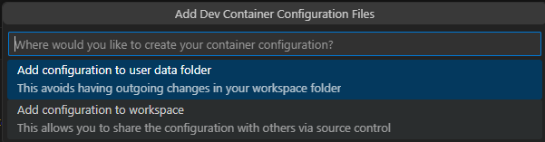
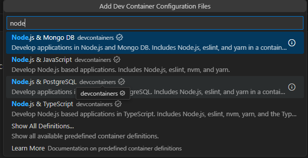
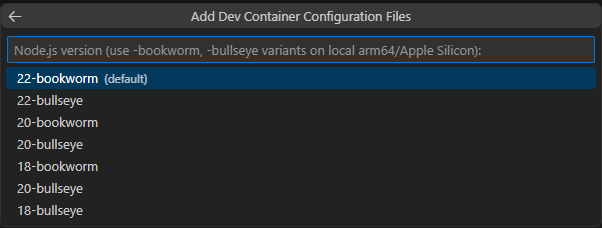
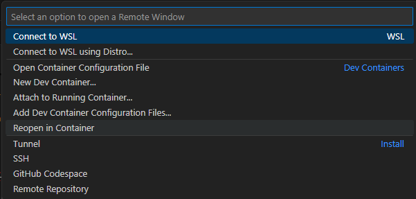
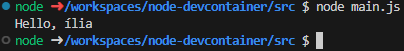

# Node PostgreSQL DevContainer Example

This repository is part of a presentation about DevContainers. Please check this repo as a starting point.

# What you will learn 

How to setup a dev environment with: 

- Node.Js

# Repo structure
```
├── .devcontainer.backup -> If you follow the tutorial, but it's not working you can use this working devcontainer to
├── src -> It contains a testing code written in node.js
```

# Setting up the devcontainer

Ensure you have `Docker`, `VSCode`, and `Dev Containers extension` installed.

Open the command palette and click `Add Dev Container Configuration Files`. This will start a wizard to create your `devcontainer.json` file.


Select `add configuration to workspace`. This will create the `devcontainer.json` inside your project allowing you to commit and share with others.



Now you need to choose the base image that your container will run. Here we will select `Node.js & JavaScript`.



Choose the node version that you want to use. Here we will keep the default one.



Done! Now you should have a `.devcontainer` folder in your project. 

Now you can start your container. You can open the `Command Palette` and click on `Reopen in Container`



After a few moments, your container will be available and ready to use. Now you can start programming, to test this you can run the following commands

```
cd src
node main.js
```

